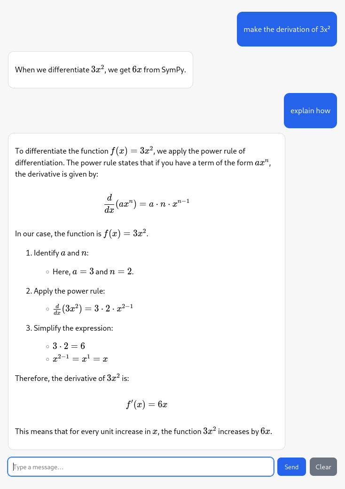

# aidu-ai-llm

Small Python LLM playground from PHBern to help people to understand how to build AI-Tutors

with:
- reusable LLM utilities under `src/aidu/ai/llm`
- a FastAPI chat backend in `serve/app.py`
- a minimal Vite frontend in `web/`

## Quick Example

```bash
pip install aidu-ai-llm aidu-support
```

create a `.env` file with your OpenAI API key in your home directory:

```bash
OPENAI_API_KEY=sk-...
```

then run the example app:

```bash
aidu-ai-llm-example
```

if your sys admin does not allow to run executables from `site-packages`, you can also run the app directly:

```bash
python -m aidu.ai.llm.demo.app
```

and ctrl click on message http://localhost:8000 to see the chat interface.

## Development Prerequisites

The following tools are required to build and run the project:

- **make** — for running common development and build tasks  
- **Python (>=3.11)** — backend runtime  
- **uv (latest)** — Python package manager and environment runner  
- **Node.js (>=18, includes npm)** — required to build the frontend (TypeScript via Vite)

### 💡 Notes

* `uv` replaces `pip`, `venv`, etc. → state of the art: no manual environment activation needed
* `npm` is included with Node.js, so you don’t need to install it separately

## Quick Start

Copy .env_example to .env and add your OpenAI Token there.

When you have ensured the prerequisites, this should work. Clean up, install dependencies, build frontend, and run the server:

```bash
make clean          # clean up python backend and web frontend
make web.install    # install web frontend dependencies
make web.build      # build web frontend
make install        # install python dependencies
make serve          # run FastAPI server
```

Open: http://localhost:8000

Then you can interact with the chat interface.



## Project Layout

```text
serve/
  app.py                 FastAPI app (chat/session endpoints + static web mount)

src/aidu/ai/llm/
  client.py              OpenAI client wrapper
  requester.py           Base class interacting with ai client
  builder.py             Prompt template builder
  safeformat.py          Safe string formatting helpers
  tool_registry.py       Tool registration/execution helpers
  spec.py                Plugin spec definitions
  evaluator.py           Evaluator overloads Requestor

test/
  curl_tests.sh          Curl-based API smoke checks

web/
  index.html             Chat page shell
  src/main.ts            Browser chat logic
  HELP.md                License/help notes
```

## Useful Commands

```bash
make smoke.client       # runs smoke test on a individual file
make smoke.requester    # runs smoke test on a individual file
make smoke.actor        # runs smoke test on a individual file
make serve              # run FastAPI server
make curl               # run curl tests against above server

cd web && make clean    # clean up web frontend
cd web && make install  # install frontend deps
cd web && make build    # build frontend
```

## Notes

- Requires `OPENAI_API_KEY` in your environment (or `.env`).
- The frontend talks to the backend session endpoints under `/sessions/...`.

