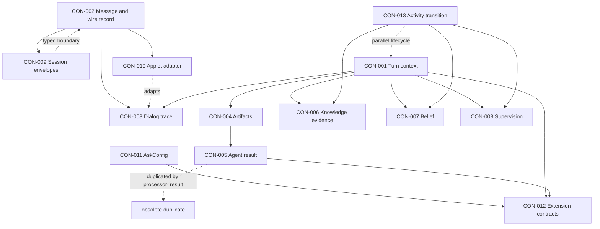

# Concept Inventory

## Scope

This audit covers `aidu-ai-llm/src/aidu/ai/core` as the subsystem of record. It also inspects `aidu-ai-llm/tests`, direct consumers under `src/aidu/ai/agents` and `src/aidu/ai/llm`, and the external scoring contract imported from `aidu.support.scoring` where those sources establish creation, conversion, or consumption paths.

Provider implementations, agent pedagogy, Director orchestration, backend persistence, frontend rendering, demo applications, and scoring internals are excluded except where a direct reference is needed to establish a core boundary. This is a concept inventory, not a class-by-class catalogue.

## Inventory metadata

- Date of audit: 2026-08-04
- Git branch: `main`
- Current commit: `89d3c1f4d7a4568c67643a8edf1ea0148a7bcf96`
- Uncommitted changes included: no; the worktree was clean when inspection began
- Directories inspected: `src/aidu/ai/core`, `tests`; direct references in `src/aidu/ai/agents` and `src/aidu/ai/llm`
- Important directories excluded: provider internals beyond direct contracts, Director and backend repositories, frontend repositories, demos, generated assets, and external scoring implementation details

## Concept index

| ID | Concept | Area | Status | Cleanup value | Cleanup risk | Depends on |
| -- | ------- | ---- | ------ | ------------- | ------------ | ---------- |
| CON-001 | Turn runtime context | Runtime state | fragmented | high | high | CON-002, CON-006, CON-007, CON-008 |
| CON-002 | Conversation message and wire record | Messaging | canonical | low | medium | CON-003, CON-009, CON-010 |
| CON-003 | Dialog trace and prompt history | Messaging | fragmented | high | medium | CON-002, CON-010 |
| CON-004 | Typed workflow artifact | Workflow data | canonical | medium | medium | — |
| CON-005 | Agent execution result and routing recommendation | Workflow control | duplicated | high | low | CON-004 |
| CON-006 | Teacher-target knowledge evidence | Learner model | canonical | medium | high | CON-013 |
| CON-007 | Student belief state | Learner model | fragmented | medium | medium | — |
| CON-008 | Tutor supervision state | Learner model | canonical | medium | medium | CON-002 |
| CON-009 | Session and routed-message envelopes | Boundary protocol | transitional | very high | high | CON-002, CON-010 |
| CON-010 | Applet interaction state adapter | Applet boundary | canonical | medium | medium | CON-002 |
| CON-011 | LLM request configuration | Provider boundary | canonical | low | medium | — |
| CON-012 | Extension and persistence contracts | Extension boundary | uncertain | low | low | CON-001, CON-005, CON-011 |
| CON-013 | Ordered activity context transition | Learning lifecycle | canonical | medium | high | CON-006, CON-007, CON-008 |

## Concepts

### CON-001 — `Turn runtime context`

**Status**

fragmented

**Purpose**

Carries the mutable state of one workflow execution: conversation history, current step, external-call permission, application state, execution control data, timing, and produced artifacts.

**Observed names**

`Context`, `Trace`, `State`, `Control`, `Context.state.data`, `Context.control.data`, `Context.artifacts`, `on_air`, `step`, `for_assessor`, `create_agent_states`.

**Representations**

- Pydantic `Context` with typed top-level fields.
- `State.data: dict[str, Any]` for learner models, session metadata, applet state, and per-agent state.
- `Control.data: dict[str, Any]` for callbacks, assessor outputs, usage, and routing flags.
- `ActivityContext` is a separate strict three-part learner context rather than a specialization or field of `Context`.

**Creation points**

`Context()` construction; orchestration code populating `state.data`; `Context.create_agent_states`; `Context.for_assessor`; `ActivityContext.neutral` for the adjacent activity lifecycle.

**Consumers**

Agents, requesters, provider clients, assessors, entry-test processing, trace renderers, and orchestration code.

**Execution paths**

Request/session data → `Context` → agent/requester mutation → artifacts and recommendations → orchestration; main context → deep-copied assessor context with `stream_callback` removed.

**Invariant**

History, durable learner/application state, and ephemeral execution controls must not be confused; assessor work must not inherit response streaming; every participating agent must have a state entry before execution.

**Current owner**

The core types enforce only the top-level shape. Agents and orchestration establish string keys and value types in the two `Any` dictionaries.

**Preferred owner**

Core should own the durable/ephemeral boundary and canonical well-known state keys. Agent-private state may remain extensible.

**Tests and contracts**

`tests/test_messages.py::test_context_creates_assessor_copy_without_stream_callback`; requester trace tests; runtime checks in `create_agent_states` and `check_agents_have_state`.

**Entropy findings**

- missing canonical representation: important typed objects are recovered from untyped string-keyed bags;
- split ownership: core, agents, and orchestration jointly define the effective schema;
- unclear lifecycle: `create_messages_trace` reconstructs roles from artifact order and contains an explicit role-assignment TODO;
- duplicate representation: strict `ActivityContext` overlaps the learner-state portion of the general context.

**Evidence**

`src/aidu/ai/core/context.py`: `State`, `Control`, `Context`, `Context.for_assessor`, `Context.create_messages_trace`, `ActivityContext`; `src/aidu/ai/agents/ai_supervisor.py` and other assessors access well-known `state.data` keys directly.

**Likely canonical form**

Keep `Context` as the turn container, but give durable shared state and ephemeral execution controls explicit typed accessors or submodels. Keep agent-private extension data behind one deliberate extension point. This conclusion is high-confidence; the exact migration mechanism is not determined here.

**Cleanup boundary**

Introduce and migrate one typed shared-state slice (session plus learner state) through context construction and one assessor path without changing provider or Director behavior.

**Dependencies**

CON-002, CON-006, CON-007, CON-008.

### CON-002 — `Conversation message and wire record`

**Status**

canonical

**Purpose**

Represents conversational input/output while preserving backend-enriched records needed to restore learner state and applet context.

**Observed names**

`Message`, `PersistedTurn`, `Messages`, persisted turn, `backend_knowledge_progress_state`, `backend_belief_state`, `backend_supervision_state`, `kind`, `actor`, `applet_input`, `to_dialog_message`.

**Representations**

- Strict `Message` represents live provider-independent conversational content.
- Strict `PersistedTurn` represents stored history, stable provider metrics, applet input, and typed learner-state snapshots.
- `Messages` is a validated collection of `PersistedTurn` and serializes to the established compact JSON list at transport and persistence boundaries.
- Provider request and response dictionaries remain boundary formats rather than history representations.
- `SessionInfo` and `RoutedMessage` are deliberately separate session and outbound-routing envelopes.

**Creation points**

`Message` validation for live content; `Messages.model_validate` for stored JSON; `PersistedTurn.from_message` and `Messages.append` for locally generated history; routed event construction for outbound events.

**Consumers**

`Trace`, requester/provider clients, learner-state restoration, applet extraction, Director/backend adapters, and frontend listeners.

**Execution paths**

Strict incoming `Message` plus `SessionInfo` → orchestration → stored JSON → one-time `Messages` validation → `PersistedTurn` history → explicit dialog/provider projections; agent output → `RoutedMessage` → backend/frontend.

**Invariant**

Live messages remain provider-independent; every internal history item is a valid `PersistedTurn`; enrichment survives compact JSON serialization; unknown persisted fields fail at `Messages` validation.

**Current owner**

`Message` owns live-content validity; `PersistedTurn` owns stored-turn validity and dialog projection; `Messages` owns collection normalization; provider clients own provider projection.

**Preferred owner**

Current owner.

**Tests and contracts**

`tests/test_messages.py` validates typed roots, compact serialization, learner-state restoration, and rejection of unknown fields; `tests/test_requester_trace_contract.py`; Director history and reassessment tests; strict Pydantic schemas.

**Entropy findings**

- resolved duplicate representation: unrestricted internal record dictionaries were replaced by `PersistedTurn`;
- resolved compatibility residue: unused `SessionResponse.to_director_payload` was removed after a repository-wide caller search;
- deliberate boundary variants: provider dictionaries, `SessionInfo`, and `RoutedMessage` have different owners and do not serve as internal history;
- retained boundary normalization: persisted JSON dictionaries are accepted only by Pydantic validation into `Messages`.

**Evidence**

`src/aidu/ai/core/context.py`: `Message`, `PersistedTurn`, `Messages`; `src/aidu/ai/core/session.py`: `SessionInfo`, `SessionResponse`, `RoutedMessage`; `src/aidu/ai/llm/requester.py`; `src/aidu/ai/agents/assessment_context.py`; Director reassessment and applet-history consumers.

**Likely canonical form**

Implemented: `Message` for live content, `PersistedTurn` for internal stored history, `Messages` as its validated collection, and typed session/routing envelopes at their respective boundaries.

**Cleanup boundary**

Complete for the identified scope. Future fields must be added deliberately to `PersistedTurn` and the backend persistence schema together.

**Dependencies**

CON-003, CON-009, CON-010.

### CON-003 — `Dialog trace and prompt history`

**Status**

fragmented

**Purpose**

Maintains ordered conversational history and derives the bounded, applet-aware history presented to models and assessors.

**Observed names**

`Trace`, `PersistedTurn.to_dialog_message`, `Messages.recent`, `before_last`, `cleaned_dialog`, `dialog_history`, `applet_state_before_last_tutor_message`, system message.

**Representations**

Typed `PersistedTurn` history; cleaned `Messages`; rendered text history; provider call trace with a prepended system message; applet state reconstructed by scanning earlier records.

**Creation points**

Session request histories, requester call-only context construction, `Context.create_messages_trace`, and applet record normalization.

**Consumers**

LLM requesters, tutor prompts, assessors, supervision chronology, and rich debug output.

**Execution paths**

Persisted records → bounded recent set → applet-aware cleaning → textual prompt history; dialog trace + current input → call-only trace with system prompt and duplicate-current-message removal.

**Invariant**

Chronological order must remain intact; system prompts must not contaminate persisted dialog; the current learner message must not appear twice; applet state must be attributed to the correct point in time.

**Current owner**

Core owns history cleanup and chronology helpers; requester owns provider-call trace construction; orchestration chooses limits and indices.

**Preferred owner**

Core should own canonical chronological selection and normalization. Requester should only adapt the selected history to a provider call.

**Tests and contracts**

`tests/test_messages.py`; `tests/test_requester_trace_contract.py`; applet-state chronology tests.

**Entropy findings**

- parallel execution path: `Context.create_messages_trace` rebuilds a trace from artifacts independently of `Messages.cleaned_dialog`;
- split ownership: duplicate suppression lives in requester while selection and cleaning live in core;
- misleading naming: `Trace.__str__` assumes element zero exists and is a system message although runtime dialog traces deliberately may begin with assistant/user.

**Evidence**

`src/aidu/ai/core/context.py`: `PersistedTurn.to_dialog_message`, `Messages`, `Trace`, `Context.create_messages_trace`; `src/aidu/ai/llm/requester.py::_context_for_llm_call`.

**Likely canonical form**

Use one raw chronological turn collection with explicit views for persistence, assessor chronology, and provider history. Retire artifact-index role inference.

**Cleanup boundary**

Remove or replace `create_messages_trace` after confirming no external consumer; then make provider-history construction consume a single normalized view.

**Dependencies**

CON-002, CON-010.

### CON-004 — `Typed workflow artifact`

**Status**

canonical

**Purpose**

Represents typed products moving between workflow agents: display text, symbolic values, applet events/commands, lifecycle events, evidence, belief, and errors.

**Observed names**

`Artifact`, `TextArtifact`, `SymbolicArtifact`, `AppletArtifact`, `JsonArtifact`, `ActivityEventArtifact`, `EvidenceArtifact`, `BeliefArtifact`, `ErrorArtifact`, `EndArtifact`, `ArtifactType`, `create_artifact`, `latest_display_artifact`.

**Representations**

Pydantic discriminated variants sharing `id`, `producer`, `type`, `step`, and `content`; a factory accepting string type names; a context dictionary indexed by artifact ID.

**Creation points**

Agents, tool-call handlers, `create_artifact`, lifecycle functions, and provider/requester output conversion.

**Consumers**

Agent routing, result aggregation, UI display selection, applet command handling, context debug output.

**Execution paths**

Agent/tool output → artifact → `AgentResult` → workflow routing or display; artifact collection → `latest_display_artifact`.

**Invariant**

Every artifact has provenance and step; discriminated variants constrain content where a concrete contract exists; display selection must ignore non-text events.

**Current owner**

Core artifacts module.

**Preferred owner**

Current owner.

**Tests and contracts**

`tests/test_artifacts.py`, `tests/test_artifact_text.py`; `ArtifactType` discriminator; factory type checks.

**Entropy findings**

- duplicate representation: direct subclass construction and a stringly typed factory are both supported;
- unnecessary/uncertain variants: `JsonArtifact` is excluded from `ArtifactType`, while `EndArtifact` has no distinct discriminator and behaves as `TextArtifact`;
- unclear invariant: base `Artifact.type: str` allows arbitrary types when instantiated directly.

**Evidence**

`src/aidu/ai/core/artifacts.py`.

**Likely canonical form**

Keep discriminated concrete artifact models and direct construction. Determine whether the factory is a true external boundary before removal. Explicitly decide whether `JsonArtifact` and `EndArtifact` are protocol variants or conveniences.

**Cleanup boundary**

Audit factory callers and variant serialization, then align `ArtifactType`, factory cases, and exported variants in one change.

**Dependencies**

None.

### CON-005 — `Agent execution result and routing recommendation`

**Status**

duplicated

**Purpose**

Bundles produced artifacts with recommendations identifying the next workflow target, allowed continuations, utility, rationale, and metadata.

**Observed names**

`AgentResult`, `Recommendation`, `UtilityResult`, `WorkflowResult`, `processor_result.AgentResult`, target, continuations, utility.

**Representations**

- Canonically used `core.agent_result.AgentResult`.
- Byte-for-byte-equivalent conceptual duplicate in `core.processor_result.AgentResult`.
- `llm.agent.UtilityResult` and `WorkflowResult` repeat subsets of the same shape.
- `Recommendation.target` and `continuations` are unconstrained `Any`, generally agent classes.

**Creation points**

Agent helpers, requesters, function-call wrappers, and direct constructors.

**Consumers**

Workflow orchestration, requester return paths, agents, and routing validation.

**Execution paths**

Agent run → `AgentResult` → recommendation selection → next agent; LLM response → text artifact + default recommendation.

**Invariant**

Results must carry only typed artifacts and routing instructions meaningful to the active agent graph.

**Current owner**

`core.agent_result` is the de facto owner; `llm.agent` validates target availability.

**Preferred owner**

One core `AgentResult` and `Recommendation` contract; orchestration should own graph-membership validation.

**Tests and contracts**

Agent and requester tests indirectly exercise the canonical import; repository search finds no import of `core.processor_result`.

**Entropy findings**

- duplicate concept: two `AgentResult` definitions;
- duplicate representation: `UtilityResult`/`WorkflowResult` subsets;
- obsolete concept: `processor_result.py` has no consumers;
- compatibility residue: a demo imports nonexistent `ProcessorResult as AgentResult`, indicating stale terminology;
- missing canonical representation: recommendation targets remain `Any` despite runtime constraints.

**Evidence**

`src/aidu/ai/core/agent_result.py`; `src/aidu/ai/core/processor_result.py`; `src/aidu/ai/core/recommendation.py`; `src/aidu/ai/llm/agent.py`; `src/aidu/ai/llm/assistants/mathAssistent_ass.py` stale import.

**Likely canonical form**

`core.agent_result.AgentResult` plus `core.recommendation.Recommendation`.

**Cleanup boundary**

Delete the unused duplicate module after repository-wide import verification; then decide separately whether utility/workflow result subclasses still encode a useful distinction.

**Dependencies**

CON-004.

### CON-006 — `Teacher-target knowledge evidence`

**Status**

canonical

**Purpose**

Stores accumulated positive/negative evidence and a derived mastery estimate for each teacher-defined target.

**Observed names**

`EvidenceKnowledgeProgress`, `StudentKnowledgeProgress`, `KnowledgeEvidenceState`, `mastery`, `entry_prior`, `entry_weight`, `source_count`, `turn_assessment_count`, `last_updated_turn`, `evidence_fingerprints`, `backend_knowledge_progress_state`.

**Representations**

Strict per-target Pydantic record; root mapping keyed by target ID; external immutable scoring state; serialized per-turn backend snapshot; tutor-facing text summary.

**Creation points**

`SessionContext.initial_student_knowledge_progress`, entry-test transition, assessor update code via `from_evidence_state`, and persisted message restoration.

**Consumers**

Tutors, learning-target assessor, supervision, activity context, backend snapshots, and teacher review.

**Execution paths**

Teacher targets → neutral progress; entry score → evidence prior → dialog assessments → accumulated evidence → snapshot → later restoration and tutor summary.

**Invariant**

`mastery` must equal the mastery derived from evidence fields; target keys originate from active teacher targets; counts and weights are non-negative; old incomplete records are rejected.

**Current owner**

Core validates the persisted form; `aidu.support.scoring` owns evidence arithmetic; assessment helpers own update policy.

**Preferred owner**

The current arithmetic/representation split is deliberate, but conversion should remain centralized in `EvidenceKnowledgeProgress`.

**Tests and contracts**

`tests/test_knowledge_progress.py`; `tests/test_activity_context.py`; model validator in `knowledge_progress.py`; message restoration tests.

**Entropy findings**

- deliberate alternate representation: Pydantic wire model versus scoring engine state;
- misleading naming: `clamped` no longer clamps and only deep-copies an already validated record;
- compatibility residue: comments and callers still frame `clamped` as numeric repair.

**Evidence**

`src/aidu/ai/core/knowledge_progress.py`; `src/aidu/ai/core/session.py::initial_student_knowledge_progress`; `src/aidu/ai/core/entry_test.py`; `src/aidu/ai/core/context.py::Messages.latest_knowledge_progress`.

**Likely canonical form**

Current strict evidence model, with conversion to the scoring value object only at the scoring boundary. Rename/remove no-op `clamped` after callers are migrated.

**Cleanup boundary**

Replace `clamped()` call sites with explicit validated copy semantics and update terminology/tests.

**Dependencies**

CON-013.

### CON-007 — `Student belief state`

**Status**

fragmented

**Purpose**

Represents domain-independent estimates of engagement, confidence, confusion, frustration, curiosity, self-explanation, guessing, and help seeking.

**Observed names**

`StudentBelief`, `StudentBeliefSnapshot`, `StudentBeliefAssessment`, `StudentKnowledge`, `backend_belief_state`, `vector`, `to_tutor_text`, `to_student_prompt`.

**Representations**

- `StudentBelief` with defaults and behavioral rendering methods.
- `StudentBeliefSnapshot` repeats the same eight fields without defaults.
- `StudentBeliefAssessment` wraps the snapshot plus review flag.
- `StudentKnowledge` in the same module is a hard-coded mathematics proficiency profile unrelated to canonical teacher-target progress.

**Creation points**

Default construction, assessment parsing, persisted message restoration, `ActivityContext.neutral`, and orchestration updates.

**Consumers**

Tutor prompt planning, student simulation prompts, supervisor, activity transitions, and persisted snapshots.

**Execution paths**

Prior belief → assessor output snapshot → canonical `StudentBelief` → tutor text/snapshot persistence → next turn.

**Invariant**

All eight values remain in `[0,1]`; assessment output is complete; no correctness-only inference should masquerade as affective evidence (policy outside core).

**Current owner**

Core owns shape and ranges; assessor/update helpers own temporal behavior.

**Preferred owner**

One canonical eight-field value model should own field definitions; assessment completeness can be expressed by requiring fields at its boundary without duplicating the field declaration manually.

**Tests and contracts**

`tests/test_messages.py`; assessor contract tests; direct range validation through Pydantic. `StudentKnowledge` has no consumers or direct tests.

**Entropy findings**

- duplicate representation: repeated belief field definitions;
- obsolete concept: hard-coded math `StudentKnowledge` is superseded conceptually by target-indexed progress and unused;
- split ownership: transition smoothing/evidence policy is external to the state model;
- unnecessary coupling: tutor and simulated-student prose generation live on the value object.

**Evidence**

`src/aidu/ai/core/belief.py`; `src/aidu/ai/core/context.py::Messages.latest_belief`; direct assessor consumers.

**Likely canonical form**

Retain `StudentBelief` as the canonical state; derive the assessment schema from it or validate a complete `StudentBelief` within the wrapper. Remove `StudentKnowledge` after confirming no external imports.

**Cleanup boundary**

First remove the unused hard-coded knowledge profile. Separately consolidate belief field declarations while preserving strict assessor output.

**Dependencies**

None.

### CON-008 — `Tutor supervision state`

**Status**

canonical

**Purpose**

Records a human-reviewable assessment of one tutor response across factual, goal, knowledge, belief, and scaffolding fit, with tutor/outcome turn provenance.

**Observed names**

`SupervisorResult`, `SupervisorState`, `SUPERVISOR_DIMENSIONS`, `prior`, `assessed_tutor_turn_index`, `outcome_student_turn_index`, `outcome_evidence_available`, `backend_supervision_state`.

**Representations**

Five named typed dimensions, provenance fields, neutral prior, and serialized per-turn snapshots.

**Creation points**

Supervisor assessor validation/update; `SupervisorState.prior`; `ActivityContext.neutral`; message restoration.

**Consumers**

Teacher review, later activity context, tutor-quality diagnostics, and assessor prompts.

**Execution paths**

Tutor turn + optional learner outcome → supervisor assessment → provenance alignment → persisted snapshot → teacher review/latest state.

**Invariant**

All five dimensions exist and scores lie in `[0,1]`; provenance identifies the assessed tutor turn and whether a subsequent outcome existed.

**Current owner**

Core owns shape; assessment helpers own chronological alignment and emission policy.

**Preferred owner**

Current division, provided provenance is always set by one boundary helper.

**Tests and contracts**

`tests/test_supervisor_state.py`, `tests/test_off_air_assessors.py`, `tests/test_activity_context.py`.

**Entropy findings**

- duplicate schema knowledge: dimension names appear both as model fields and `SUPERVISOR_DIMENSIONS`;
- split ownership: chronology cannot be validated by the model alone and is enforced in orchestration/update code.

**Evidence**

`src/aidu/ai/core/supervisor.py`; `src/aidu/ai/core/context.py::Messages.latest_supervisor`.

**Likely canonical form**

Current explicit model. Derive the dimension collection from declared fields or a single constant only if doing so remains clear.

**Cleanup boundary**

Centralize snapshot construction/provenance validation without changing the five explicit review dimensions.

**Dependencies**

CON-002.

### CON-009 — `Session and routed-message envelopes`

**Status**

transitional

**Purpose**

Separates a clean conversational message from backend session metadata and from Director/frontend routing metadata.

**Observed names**

`SessionContext`, `SessionInfo`, `SessionResponse`, `RoutedMessage`, `domain_prompt_metadata`, `applet_prompt_metadata`.

**Representations**

Typed session metadata; typed message-plus-info response; typed routed event with optional applet commands, lifecycle event, and learner-state snapshots.

**Creation points**

Backend request/session adapters and actor/director event adapters.

**Consumers**

Director actors, tutor prompt builders, backend listeners, and frontend event handling.

**Execution paths**

Backend session request → `SessionResponse` → actor context; actor output → `RoutedMessage` → backend/frontend.

**Invariant**

Session metadata must not become valid core message metadata; routed fields belong only to outbound events; active target IDs determine initial knowledge keys.

**Current owner**

Core defines envelopes; external adapters choose typed or flattened path.

**Preferred owner**

Core envelopes with boundary adapters; callers should consume typed envelopes directly.

**Tests and contracts**

`tests/test_session_context.py`; strict Pydantic configuration; direct integration consumers outside this repository.

**Entropy findings**

- resolved compatibility residue: the unused flattened Director payload helper was removed;
- parallel execution path: complete applet metadata versus fallback scalar applet fields;
- split ownership: `SessionContext.extra="allow"` makes its effective contract expandable outside core;
- misleading collision: a separate demo defines another unrelated `SessionResponse`.

**Evidence**

`src/aidu/ai/core/session.py`; `src/aidu/ai/llm/demo/app.py` separate session response; Director consumers found by repository references.

**Likely canonical form**

Implemented for flattening: `SessionResponse(message, info)` is the typed inbound envelope and `RoutedMessage` is the typed outbound envelope.

**Cleanup boundary**

Resolve the remaining `SessionContext` applet-metadata fallback and permissive extra-field policy as a separate vertical cleanup.

**Dependencies**

CON-002, CON-010.

### CON-010 — `Applet interaction state adapter`

**Status**

canonical

**Purpose**

Keeps structured applet submissions as the source of truth while deriving compact textual history when an LLM needs it.

**Observed names**

`AppletInfo`, `applet`, `infoStore`, `payload`, `from_payload`, `from_snapshot`, `from_message`, `to_state`, `selected_info`, `to_text`, `applet_input`, `Applet event:`.

**Representations**

Frozen dataclass; raw payload; separated applet ID and info-store view; JSON snapshot compatibility text; derived prompt text; `AppletArtifact` at workflow boundaries.

**Creation points**

Frontend applet payloads, persisted messages, and legacy `Applet input:` textual snapshots.

**Consumers**

Message cleaning, applet-aware tutor/student agents, chronology lookup, and applet artifacts.

**Execution paths**

Structured applet input → `AppletInfo` → preserved state and derived prompt text; legacy text → JSON parse → same adapter.

**Invariant**

Structured payload remains authoritative; text is derived only for prompting; invalid legacy snapshots do not crash history construction.

**Current owner**

Core applet adapter.

**Preferred owner**

Current owner.

**Tests and contracts**

`tests/test_applet_info.py`; applet-history and chronology tests in `tests/test_messages.py`; `AppletArtifact` tests.

**Entropy findings**

- compatibility residue: parsing `content` beginning with `Applet input:`;
- duplicate representation: payload and copied `info_store` can theoretically diverge if constructed directly rather than through factories;
- unclear boundary: `to_state` returns the original mutable payload despite the dataclass being frozen.

**Evidence**

`src/aidu/ai/core/applet_info.py`; `src/aidu/ai/core/context.py::PersistedTurn.to_dialog_message`; `src/aidu/ai/core/artifacts.py::AppletArtifact`.

**Likely canonical form**

Structured payload with a validated info-store view and explicit text adapter. Legacy text parsing should remain only at the persistence boundary while old records exist.

**Cleanup boundary**

Measure legacy snapshot use, then isolate or remove `Applet input:` parsing; make immutability semantics explicit.

**Dependencies**

CON-002.

### CON-011 — `LLM request configuration`

**Status**

canonical

**Purpose**

Carries per-call response, sampling, tool-call, and vendor-specific options independently of a particular provider client.

**Observed names**

`AskConfig`, `json_mode`, `route_mode`, `temperature`, `max_tokens`, `tools`, `tool_choice`, `vendor_config`.

**Representations**

Mutable dataclass passed to agents, requesters, evaluators, and provider adapters; provider clients translate it into vendor arguments.

**Creation points**

Agents, requester defaults, evaluators, plugin setup, and tests.

**Consumers**

OpenAI, Google, and SymPy clients; LLM requester and agent APIs.

**Execution paths**

Agent policy → `AskConfig` → requester tool injection → provider translation.

**Invariant**

Portable fields have consistent meaning across providers; provider-only options remain in the escape hatch; per-call values do not silently mutate shared defaults.

**Current owner**

Core owns vocabulary; requesters and clients own merging and translation.

**Preferred owner**

Current owner, with documented merge precedence.

**Tests and contracts**

Streaming/client tests and extensive typed call sites; no direct configuration precedence test was found.

**Entropy findings**

- unclear ownership: precedence between client-level config, per-call fields, and `vendor_config` is distributed;
- compatibility risk: `route_mode` appears in the core contract but no direct consumer was found in the inspected references.

**Evidence**

`src/aidu/ai/core/config.py`; `src/aidu/ai/llm/requester.py`; `src/aidu/ai/llm/clients/openai.py`; `src/aidu/ai/llm/clients/google.py`.

**Likely canonical form**

Current portable dataclass plus explicit documented merge order. Mark unused fields only after repository-wide confirmation.

**Cleanup boundary**

Add provider-independent precedence tests and remove confirmed-unused options separately.

**Dependencies**

None.

### CON-012 — `Extension and persistence contracts`

**Status**

uncertain

**Purpose**

Defines intended seams for provider clients, chat/cognitive agents, assistant discovery plugins, and context persistence.

**Observed names**

`ClientProtocol`, `ChatAgentProtocol`, `CognitiveAgentProtocol`, `HookSpecs.get_assistants`, `hookspec`, `hookimpl`, `ContextStore.load`, `ContextStore.save`.

**Representations**

Typing protocols, Pluggy hook markers/specification, and a concrete skeleton class with ellipsis method bodies.

**Creation points**

Core declarations; plugin implementations for hooks.

**Consumers**

`ClientProtocol` and `ChatAgentProtocol` are re-exported but no typed consumers were found; Pluggy markers are consumed by plugin code; `ContextStore` has no consumer in the repository.

**Execution paths**

Potential client/agent structural typing; plugin discovery via `get_assistants`; hypothetical session persistence through `ContextStore`.

**Invariant**

An extension contract should match the actual runtime method vocabulary and have a real owner/consumer.

**Current owner**

Core declarations, with actual runtime contracts primarily enforced by abstract agent classes and requester code elsewhere.

**Preferred owner**

Keep only contracts used at real boundaries. Persistence should be a `Protocol` or abstract base if external implementations are intended.

**Tests and contracts**

No direct tests found for protocols, hookspecs, or `ContextStore` in the inspected suite.

**Entropy findings**

- obsolete/unused concept: `ContextStore` skeleton;
- unclear lifecycle: no context persistence ownership or error semantics;
- compatibility residue: protocols use `chat` while active client/requester code predominantly uses `ask`;
- unnecessary abstraction: unused structural protocols may describe an earlier API;
- missing contract tests for plugin discovery.

**Evidence**

`src/aidu/ai/core/context_store.py`; `src/aidu/ai/core/protocols.py`; `src/aidu/ai/core/hookspecs.py`; exports in `src/aidu/ai/core/__init__.py`.

**Likely canonical form**

Uncertain. Pluggy hooks appear intentional. The protocols and context-store skeleton should either be aligned to live APIs and tested or removed from the core surface.

**Cleanup boundary**

Inventory external package imports first; then remove one unused contract at a time or add a consumer-owned contract test.

**Dependencies**

CON-001, CON-005, CON-011.

### CON-013 — `Ordered activity context transition`

**Status**

canonical

**Purpose**

Carries knowledge, belief, and supervision from one ordered learning activity to the next and applies entry-test scoring without mutating the previous context.

**Observed names**

`ActivityContext`, `neutral`, `populate_activity_context`, `process_entry_test`, `EntryTestScore`, `score_poll_test`, `initialize_from_entry_prior`.

**Representations**

Strict three-field Pydantic context; external entry-test score; next-context copy with replaced/extended knowledge and deep-copied belief/supervision.

**Creation points**

`ActivityContext.neutral`; `process_entry_test`; `populate_activity_context`.

**Consumers**

Activity sequencing and tests. Direct runtime consumers outside the core repository were not found in this audit.

**Execution paths**

Prior activity context + authored questions/responses → scoring → target priors → next activity context; no priors → cloned carry-forward state.

**Invariant**

All three learner-state elements are present; unknown fields are rejected; activity `n` derives only from `n-1`; the previous context and nested belief/supervision are not mutated.

**Current owner**

Core owns transition assembly; scoring package owns poll interpretation and evidence initialization.

**Preferred owner**

Current owner, if the backend activity sequence actually consumes this contract.

**Tests and contracts**

`tests/test_activity_context.py` covers neutral state, strictness, carry-forward, scoring, and non-mutation.

**Entropy findings**

- parallel state path: the runtime commonly restores learner snapshots from enriched `Messages`, while ordered activities use a separate `ActivityContext` path;
- uncertain lifecycle: no direct production consumer was found within this repository;
- split ownership: overall-score fallback and target-specific priors come from external scoring semantics.

**Evidence**

`src/aidu/ai/core/context.py::ActivityContext`; `src/aidu/ai/core/entry_test.py`; `tests/test_activity_context.py`.

**Likely canonical form**

The strict transition object is suitable as the canonical inter-activity state, but production ownership must be verified before integrating it into `Context` or removing the parallel snapshot path.

**Cleanup boundary**

Trace one production entry-test-to-activity path across repositories and decide whether `ActivityContext` is the active contract or an isolated implementation.

**Dependencies**

CON-006, CON-007, CON-008.

## Relationship map

## Cleanup queue

| Priority | Concept ID | Reason | Prerequisites | Suggested cleanup scope |
| -------- | ---------- | ------ | ------------- | ----------------------- |
| 1 | CON-001 | Shared state/control invariants are hidden in `dict[str, Any]`, causing ownership and lifecycle ambiguity across every assessor and agent | CON-006, CON-007, CON-008 shapes stable | Type one shared-state slice and one ephemeral-control slice end to end |
| 2 | CON-005 | Exact unused `AgentResult` duplicate and overlapping result subclasses create low-risk removable entropy | CON-004 variant contract confirmed | Remove `processor_result.py`, repair stale demo reference, then reassess result subclasses |
| 3 | CON-003 | Artifact-based trace reconstruction remains parallel to typed persisted history | CON-002 canonical persisted-turn contract | Retire artifact-order role inference and centralize history views |
| 4 | CON-007 | Duplicate belief fields plus unused hard-coded knowledge model | External import check | Remove `StudentKnowledge`; derive strict assessment shape from canonical belief fields |
| 5 | CON-012 | Several untested, apparently unused abstractions describe APIs different from live code | External package import inventory | Remove or align one extension contract at a time |
| 6 | CON-013 | Strict lifecycle model may be parallel to the production snapshot path | Cross-repository runtime trace | Decide and document active inter-activity state ownership |
| 7 | CON-009 | Applet metadata fallback and permissive session-context expansion retain split boundary ownership | CON-002 typed boundary | Make one applet metadata contract authoritative and constrain session extras |
| 8 | CON-010 | Legacy text parsing and shallow immutability remain | Persistence usage measurement | Isolate or remove `Applet input:` parsing and define copy/immutability behavior |
| 9 | CON-006 | `clamped` terminology no longer describes behavior | None | Replace no-op compatibility method and update callers |

## Cross-cutting findings

- Typed shells frequently contain untyped dictionaries at the highest-change integration points (`State.data`, `Control.data`, target dictionaries, and recommendation targets); persisted message records are no longer part of this pattern.
- Compatibility is usually implemented as permissive fallback behavior: scalar-versus-complete applet metadata, structured-versus-text applet snapshots, and default latest-state recovery. The unused flattened session-message payload was removed.
- Learner state has two transport paths: snapshots embedded in message records and the strict ordered `ActivityContext`. Their production relationship is not explicit in core.
- Several concepts mix value representation with prompt prose (`StudentBelief`, `StudentKnowledgeProgress`, `AppletInfo`). This is convenient but makes core state sensitive to tutoring language and policy changes.
- Validation is strongest for learner evidence and supervision, but weaker at workflow routing and context extension boundaries.
- Stale naming remains in comments and compatibility code (`processor_result`, `ProcessorResult`, `clamped`, `chat` protocols versus live `ask`). These are symptoms of execution-path transitions rather than cosmetic issues alone.
- The boundary distinction between deliberate variants and accidental duplication is clearest for knowledge evidence: the scoring state and persisted Pydantic state serve different layers and have centralized conversions. The duplicate `AgentResult` modules do not have such a distinction.

## Open questions

1. Are `ContextStore`, `ClientProtocol`, `ChatAgentProtocol`, or `CognitiveAgentProtocol` imported by packages outside `aidu-ai-llm`?
2. Is `ActivityContext` used in the production backend activity sequence, or only in tests and planned integration work?
3. Do persisted records using the textual `Applet input:` format still exist in supported databases?
4. Is `Context.create_messages_trace` called outside this repository, and can its artifact-order role inference be retired?
5. Is `route_mode` in `AskConfig` consumed by an external provider or plugin?
6. Are `JsonArtifact` and `EndArtifact` intended wire-level variants, or only local conveniences?
7. Should teacher target dictionaries become a core typed contract, or remain backend-owned metadata passed through `SessionContext`?

## Resolved findings

| Date | Concept ID | Resolution | Commit |
| ---- | ---------- | ---------- | ------ |
| 2026-08-04 | CON-002 | Replaced unrestricted internal history dictionaries with strict `PersistedTurn`, centralized history projection, and removed unused flattened session payload compatibility. | committed |

## Change log

| Date | Commit | Scope | Added concepts | Changed concepts | Resolved concepts |
| ---- | ------ | ----- | -------------- | ---------------- | ----------------- |
| 2026-08-04 | `89d3c1f4d7a4568c67643a8edf1ea0148a7bcf96` | Initial audit of `src/aidu/ai/core` with tests and direct consumers | CON-001–CON-013 | — | — |
| 2026-08-04 | `uncommitted` | Vertical consolidation of persisted conversation turns and their direct consumers | — | CON-002, CON-003, CON-009, CON-010 | CON-002 unrestricted history dictionaries and flattened payload |
